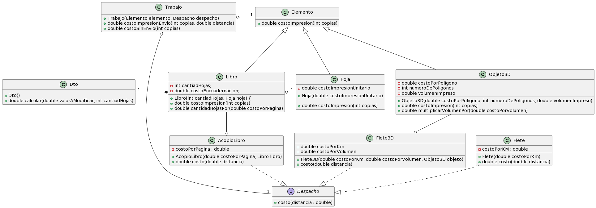
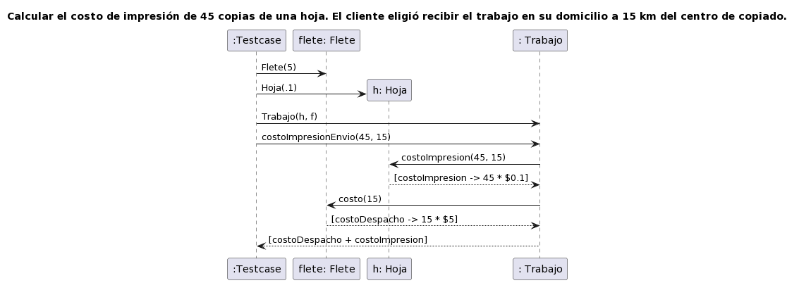
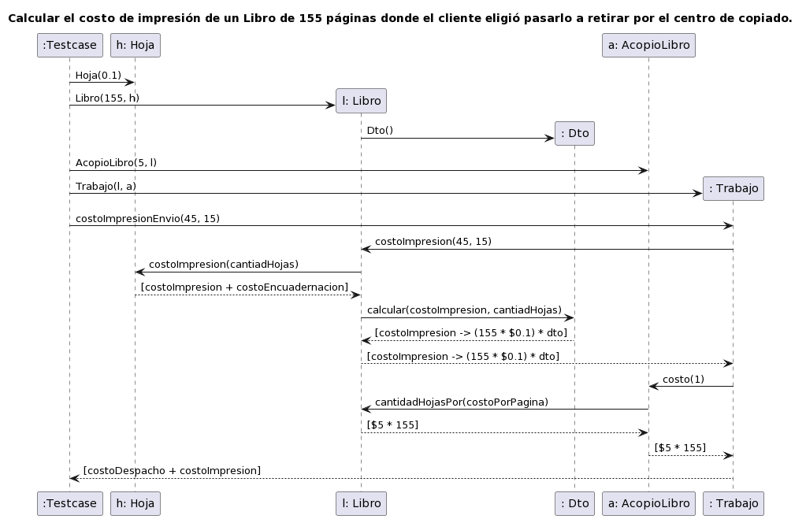
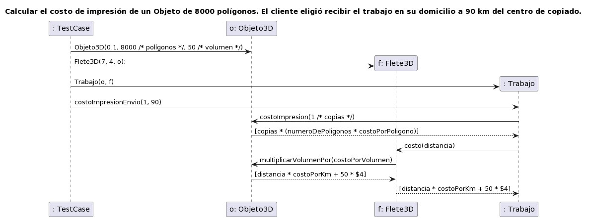

## Posible solución

Esta solución no implementa el patrón double dispach **intensionalmente.**

[Enunciado](enunciado/Parcial%20primera%20oportunidad%202022%2002%20C.pdf)

### Diagrama de clases

### Diagrama de secuencia 1

### Diagrama de secuencia 2

### Diagrama de secuencia 3

